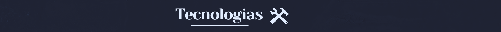

<ul>
  <li>💻 Opa!! Meu nome é Yasmin, tenho 17 anos e atualmente trabalho como dev júnior full stack na <a href="https://www.linkedin.com/company/dbserver/mycompany/">DB</a>.</li>
  <li>🔭 No momento, minhas tecnologias mais consolidadas pelo manuseio diário no time são Java + Spring (back), e Javascript + React (front).</li>
  <li>🚀 Acredito muito na importância do compartilhamento de conhecimentos na área e sempre me diverti muito com criação de conteúdos. Foi assim que surgiu a <a href="https://www.instagram.com/station.dev/">DEV Station</a>: um perfil no Instagram e canal no Youtube com conteúdos sobre programação - meu xodó :)</li>
  <li>📍 Porto Alegre - Rio Grande do Sul</li>
</ul>

<table align="center" height="255px">
  <tr>
    <td align="center">
      <a href="https://developer.mozilla.org/en-US/docs/Web/JavaScript/">
         
        
          <b>
            <pre>Javascript</pre>
          </b>
        
      </a>
    </td>
    <td align="center">
      <a href="https://pt-br.reactjs.org/">
         
        
          <b>
            <pre>React</pre>
          </b>
        
      </a>
    </td>
        <td align="center">
      <a href="https://pt-br.reactjs.org/">
         
        
          <b>
            <pre>Java</pre>
          </b>
        
      </a>
    </td>
        </td>
        <td align="center">
      <a href="https://pt-br.reactjs.org/">
         
        
          <b>
            <pre>Spring</pre>
          </b>
        
      </a>
    </td>
      <td align="center">
      <a href="https://developer.mozilla.org/en-US/docs/Web/HTML/">
         
        
          <b>
            <pre>HTML5</pre>
          </b>
        
      </a>
    </td>
    <td align="center">
      <a href="https://developer.mozilla.org/en-US/docs/Web/CSS/">
         
        
          <b>
            <pre>CSS</pre>
          </b>
        
      </a>
    </td>
    <td align="center">
      <a href="https://code.visualstudio.com/">
         
        
          <b>
            <pre>Git</pre>
          </b>
        
      </a>
    </td>
        <td align="center">
      <a href="https://axios-http.com/docs/intro">
       
      
        <b>
          <pre>Github</pre>
        </b>
      
      </a>
    </td>
    <td align="center">
      <a href="https://axios-http.com/docs/intro">
       
      
        <b>
          <pre>Gitlab</pre>
        </b>
      
      </a>
    </td>
  </tr>
  <tr>
<td align="center">
      <a href="https://axios-http.com/docs/intro">
       
      
        <b>
          <pre>JUnit</pre>
        </b>
      
      </a>
    </td>
    <td align="center">
      <a href="https://axios-http.com/docs/intro">
       
      
        <b>
          <pre>Jest</pre>
        </b>
      
      </a>
    </td>
    <td align="center">
      <a href="https://axios-http.com/docs/intro">
       
      
        <b>
          <pre>Cypress</pre>
        </b>
      
      </a>
    </td>
        <td align="center">
      <a href="https://axios-http.com/docs/intro">
       
      
        <b>
          <pre>Rest Assured</pre>
        </b>
      
      </a>
    </td>
        <td align="center">
      <a href="https://axios-http.com/docs/intro">
       
      
        <b>
          <pre>Selenium</pre>
        </b>
      
      </a>
    </td>
            <td align="center">
      <a href="https://axios-http.com/docs/intro">
       
      
        <b>
          <pre>Linguagem SQL</pre>
        </b>
      
      </a>
    </td>
    
  </tr>
</table>
 

  

    
  
  
   
  

  

<table height="100px" align="center">
  <tr>
    <td>
    <a align="center" href="https://github.com/ysncastro/portifolio-leticia-cruz-psicologa" target="_blank">
      Portifólio Leticia Cruz - PSICÓLOGA
    </a>
    </td>
  </tr>
</table>

