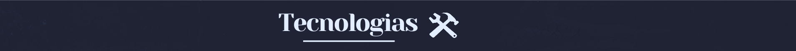

<ul>
  
💻 Opa!! Meu nome é Yasmin, tenho 20 anos e atuo como dev pleno full stack na <a href="https://www.linkedin.com/company/dbserver/mycompany/">DB</a> desde 2021.

  
📍 Porto Alegre - Rio Grande do Sul

</ul>

 

<table align="center" height="290px">
  <tr>
    <td align="center">
      <a href="https://developer.mozilla.org/en-US/docs/Web/JavaScript/">
         
        
          <b>
            <pre>Javascript</pre>
          </b>
        
      </a>
    </td>
        <td align="center">
      <a href="https://developer.mozilla.org/en-US/docs/Web/JavaScript/">
         
        
          <b>
            <pre>Typescript</pre>
          </b>
        
      </a>
    </td>
            <td align="center">
      <a href="https://pt-br.reactjs.org/">
         
        
          <b>
            <pre>Java</pre>
          </b>
        
      </a>
    </td>
        </td>
              <td align="center">
      <a href="https://pt-br.reactjs.org/">
         
        
          <b>
            <pre>Kotlin</pre>
          </b>
        
      </a>
    </td>
    <td align="center">
      <a href="https://pt-br.reactjs.org/">
         
        
          <b>
            <pre>React</pre>
          </b>
        
      </a>
    </td>
        <td align="center">
      <a href="https://pt-br.reactjs.org/">
         
        
          <b>
            <pre>Angular</pre>
          </b>
        
      </a>
    </td>
        <td align="center">
      <a href="https://pt-br.reactjs.org/">
         
        
          <b>
            <pre>Spring</pre>
          </b>
        
      </a>
    </td>
      <td align="center">
      <a href="https://developer.mozilla.org/en-US/docs/Web/HTML/">
         
        
          <b>
            <pre>HTML5</pre>
          </b>
        
      </a>
    </td>
    <td align="center">
      <a href="https://developer.mozilla.org/en-US/docs/Web/CSS/">
         
        
          <b>
            <pre>CSS</pre>
          </b>
        
      </a>
    </td>
      </tr>
  <tr>
    <td align="center">
      <a href="https://code.visualstudio.com/">
         
        
          <b>
            <pre>Git</pre>
          </b>
        
      </a>
    </td>
        <td align="center">
      <a href="https://axios-http.com/docs/intro">
       
      
        <b>
          <pre>Github</pre>
        </b>
      
      </a>
    </td>
    <td align="center">
      <a href="https://axios-http.com/docs/intro">
       
      
        <b>
          <pre>Gitlab</pre>
        </b>
      
      </a>
    </td>
<td align="center">
      <a href="https://axios-http.com/docs/intro">
       
      
        <b>
          <pre>JUnit</pre>
        </b>
      
      </a>
    </td>
    <td align="center">
      <a href="https://axios-http.com/docs/intro">
       
      
        <b>
          <pre>Jest</pre>
        </b>
      
      </a>
    </td>
    <td align="center">
      <a href="https://axios-http.com/docs/intro">
       
      
        <b>
          <pre>Cypress</pre>
        </b>
      
      </a>
    </td>
        <td align="center">
      <a href="https://axios-http.com/docs/intro">
       
      
        <b>
          <pre>Rest Assured</pre>
        </b>
      
      </a>
    </td>
        <td align="center">
      <a href="https://axios-http.com/docs/intro">
       
      
        <b>
          <pre>Selenium</pre>
        </b>
      
      </a>
    </td>
            <td align="center">
      <a href="https://axios-http.com/docs/intro">
       
      
        <b>
          <pre>Linguagem SQL</pre>
        </b>
      
      </a>
    </td>
    
  </tr>
</table>
 

 

  
  
   
  

 
